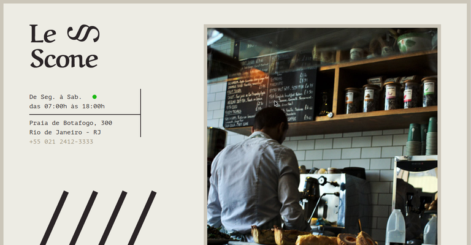

# Le-Scone
Projeto desenvolvido para explorar os conceitos abordados no SASS.

<h1 align="center">
    
</h1>

<h4 align="center"> 
	🚧 Le Scone 🐺 em construção... 🚧
</h4>

## 💻 Sobre o projeto

Projeto desenvolvido para explorar os conceitos abordados no SASS.

Todo conteúdo pertence à Origamid (https://www.origamid.com)

Conteudo:

- O que é SASS - Introdução
- SASS vs SCSS - Diferença entre SASS e SCSS: SASS respeita identação, ponto e vírgula
- Import - Importar arquivos no sass
- Variáveis - Criando e usando variáveis
- Nesting - Colocar um seletor dentro do outro, caractere '&'
- Mixins - Código que encapsula valores e pode ser reaproveitado através do  @include, explicando o @content
- Extend - extend classe css
- Operadores - Soma, subtração, multiplicação, divisão (de pixels, por exemplo)
- Condicionais - if,
- Funções - Funções do sass e como criá-las
- Loop - Explicando @for e @while
- Import para organizar - Transformando arquivos do bitcraft em scss e importando em um scss principal
- Variáveis Cores - Alterar as cores dos arquivos scss para usar variáveis
  Mixins Tipografia - Alterar tamanho e fonte dos arquivos scss para serem obtidos por @mixin
- Grid - Cração de Grid com scss
- Criação do site Le Scone
